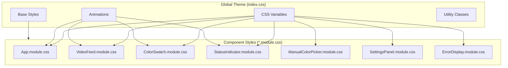

# Design Document: HUD / Sci-Fi FUI Refactor

## Overview

This design document describes the technical approach for refactoring the Shelly IoT Color Picker application's user interface to a professional HUD (Heads-Up Display) / Sci-Fi FUI (Futuristic User Interface) design. The application already has a partial HUD theme implementation in `src/index.css` and component-level CSS modules. This refactor will enhance, complete, and polish the existing design system to create a cohesive, visually impressive interface suitable for the JFokus 2026 conference demonstration.

The refactor is primarily CSS-focused, with minimal changes to React component logic. The existing component structure (App, VideoFeed, ColorSwatch, StatusIndicator, ManualColorPicker, SettingsPanel, ErrorDisplay) will be preserved, with styling enhancements applied through CSS Modules.

## Architecture

The HUD theme architecture follows a layered approach:

```
┌─────────────────────────────────────────────────────────────┐
│                    Global Theme Layer                        │
│  (src/index.css - CSS Variables, Base Styles, Animations)   │
├─────────────────────────────────────────────────────────────┤
│                   Component Style Layer                      │
│  (*.module.css - Component-specific HUD styling)            │
├─────────────────────────────────────────────────────────────┤
│                    React Component Layer                     │
│  (*.tsx - Minimal changes, className bindings)              │
└─────────────────────────────────────────────────────────────┘
```

### Design System Flow



## Components and Interfaces

### 1. Global Theme System (index.css)

The global theme defines all CSS custom properties and base styles.

```typescript
// Theme configuration (conceptual - implemented as CSS variables)
interface HUDTheme {
  colors: {
    primary: string;        // #00f0ff - Cyan
    primaryDim: string;     // #00a8b3
    primaryGlow: string;    // rgba(0, 240, 255, 0.4)
    secondary: string;      // #ff3366 - Pink/Red
    accent: string;         // #00ff88 - Green
    warning: string;        // #ffaa00 - Orange
    error: string;          // #ff3333 - Red
    bgDark: string;         // #0a0e14
    bgMedium: string;       // #0d1117
    bgLight: string;        // #161b22
    bgPanel: string;        // rgba(13, 17, 23, 0.85)
    bgGlass: string;        // rgba(0, 240, 255, 0.03)
    textPrimary: string;    // #e6f7ff
    textSecondary: string;  // #8ba4b4
    textDim: string;        // #4a5568
    border: string;         // rgba(0, 240, 255, 0.3)
    borderBright: string;   // rgba(0, 240, 255, 0.6)
    borderDim: string;      // rgba(0, 240, 255, 0.15)
  };
  typography: {
    fontDisplay: string;    // 'Orbitron', 'Rajdhani', monospace
    fontMono: string;       // 'JetBrains Mono', 'Fira Code', monospace
    fontBody: string;       // 'Inter', system-ui, sans-serif
  };
  spacing: {
    xs: string;  // 0.25rem
    sm: string;  // 0.5rem
    md: string;  // 1rem
    lg: string;  // 1.5rem
    xl: string;  // 2rem
    xxl: string; // 3rem
  };
  timing: {
    fast: string;    // 150ms ease
    normal: string;  // 250ms ease
    slow: string;    // 400ms ease
  };
  radius: {
    sm: string;  // 4px
    md: string;  // 8px
    lg: string;  // 12px
    xl: string;  // 16px
  };
}
```

### 2. Animation Definitions

```css
/* Key animations for the HUD theme */
@keyframes hud-pulse {
  0%, 100% { opacity: 1; }
  50% { opacity: 0.5; }
}

@keyframes hud-scan {
  0% { transform: translateY(-100%); }
  100% { transform: translateY(100%); }
}

@keyframes hud-flicker {
  0%, 100% { opacity: 1; }
  92% { opacity: 1; }
  93% { opacity: 0.8; }
  94% { opacity: 1; }
  96% { opacity: 0.9; }
  97% { opacity: 1; }
}

@keyframes hud-glow-pulse {
  0%, 100% { box-shadow: var(--hud-glow-sm); }
  50% { box-shadow: var(--hud-glow-md); }
}

@keyframes hud-data-stream {
  0% { background-position: 0% 0%; }
  100% { background-position: 100% 100%; }
}
```

### 3. FUI Panel Component Pattern

All panel components follow a consistent structure:

```css
/* FUI Panel base pattern */
.fuiPanel {
  background: var(--hud-bg-panel);
  border: 1px solid var(--hud-border);
  border-radius: var(--radius-md);
  backdrop-filter: blur(10px);
  position: relative;
  overflow: hidden;
}

/* Panel header decoration */
.fuiPanel::before {
  content: 'PANEL TITLE';
  position: absolute;
  top: 0;
  left: 0;
  right: 0;
  padding: var(--space-xs) var(--space-md);
  font-family: var(--font-display);
  font-size: 0.625rem;
  font-weight: 600;
  letter-spacing: 0.2em;
  text-transform: uppercase;
  color: var(--hud-text-dim);
  background: var(--hud-bg-light);
  border-bottom: 1px solid var(--hud-border);
}

/* Animated top border */
.fuiPanel::after {
  content: '';
  position: absolute;
  top: 0;
  left: 0;
  right: 0;
  height: 2px;
  background: linear-gradient(90deg, transparent, var(--hud-primary), transparent);
  animation: hud-data-stream 3s linear infinite;
}
```

### 4. Corner Bracket Decoration Pattern

```css
/* Corner brackets for targeting/framing effect */
.cornerBrackets::before,
.cornerBrackets::after {
  content: '';
  position: absolute;
  width: 40px;
  height: 40px;
  border: 2px solid var(--hud-primary);
  pointer-events: none;
  z-index: 10;
}

.cornerBrackets::before {
  top: 12px;
  left: 12px;
  border-right: none;
  border-bottom: none;
}

.cornerBrackets::after {
  bottom: 12px;
  right: 12px;
  border-left: none;
  border-top: none;
}
```

### 5. Component-Specific Enhancements

#### App Component (App.module.css)
- Main container with corner decorations
- Header with animated data stream border
- Mode indicator with status-colored glow
- Settings button with rotating gear animation

#### VideoFeed Component (VideoFeed.module.css)
- Corner brackets on video container
- Placeholder with grid pattern and scan line animation
- Subtle video filters (contrast, saturation)

#### ColorSwatch Component (ColorSwatch.module.css)
- Large swatch with holographic shine overlay
- RGB channel breakdown with color-coded borders
- Monospace font for values with glow effect

#### StatusIndicator Component (StatusIndicator.module.css)
- Status-colored top border (green/orange/red)
- Pulsing indicator dot for connecting state
- Icon glow matching status color

#### ManualColorPicker Component (ManualColorPicker.module.css)
- RGB sliders with gradient tracks
- Color-coded channel borders
- Preset color buttons with hover effects

#### SettingsPanel Component (SettingsPanel.module.css)
- Modal overlay with blur backdrop
- Panel appear animation
- Form inputs with HUD styling

#### ErrorDisplay Component (ErrorDisplay.module.css)
- Alert styling with pulsing border
- Type-specific colors (webcam=red, shelly=orange)
- Retry button with HUD styling

## Data Models

### Theme Configuration Types

```typescript
// CSS Variable names as TypeScript constants
export const HUD_COLORS = {
  PRIMARY: '--hud-primary',
  PRIMARY_DIM: '--hud-primary-dim',
  PRIMARY_GLOW: '--hud-primary-glow',
  SECONDARY: '--hud-secondary',
  ACCENT: '--hud-accent',
  WARNING: '--hud-warning',
  ERROR: '--hud-error',
  BG_DARK: '--hud-bg-dark',
  BG_MEDIUM: '--hud-bg-medium',
  BG_LIGHT: '--hud-bg-light',
  BG_PANEL: '--hud-bg-panel',
  TEXT_PRIMARY: '--hud-text-primary',
  TEXT_SECONDARY: '--hud-text-secondary',
  TEXT_DIM: '--hud-text-dim',
  BORDER: '--hud-border',
  BORDER_BRIGHT: '--hud-border-bright',
  BORDER_DIM: '--hud-border-dim',
} as const;

export const HUD_ANIMATIONS = {
  PULSE: 'hud-pulse',
  SCAN: 'hud-scan',
  FLICKER: 'hud-flicker',
  GLOW_PULSE: 'hud-glow-pulse',
  DATA_STREAM: 'hud-data-stream',
} as const;

// Status colors mapping
export type StatusColor = 'connected' | 'disconnected' | 'connecting';

export const STATUS_COLORS: Record<StatusColor, string> = {
  connected: 'var(--hud-accent)',      // Green
  disconnected: 'var(--hud-error)',    // Red
  connecting: 'var(--hud-warning)',    // Orange
};
```

### Responsive Breakpoints

```typescript
export const BREAKPOINTS = {
  MOBILE: 768,      // px - Single column layout
  DESKTOP: 1024,    // px - Two column layout
  LARGE: 1920,      // px - Conference display scaling
} as const;

export const CORNER_BRACKET_SIZES = {
  MOBILE: 50,       // px
  DESKTOP: 100,     // px
  LARGE: 150,       // px
} as const;

export const COLOR_SWATCH_HEIGHTS = {
  MOBILE: 180,      // px
  DESKTOP: 280,     // px
  LARGE: 400,       // px
} as const;
```


## Correctness Properties

*A property is a characteristic or behavior that should hold true across all valid executions of a system—essentially, a formal statement about what the system should do. Properties serve as the bridge between human-readable specifications and machine-verifiable correctness guarantees.*

Based on the prework analysis, the following properties have been identified for property-based testing:

### Property 1: Animation Duration Bounds

*For any* animation defined in the HUD theme CSS, the animation-duration value SHALL be less than or equal to 4 seconds.

**Validates: Requirements 2.6**

This property ensures that all animations complete within a reasonable time frame to avoid performance issues and maintain a responsive feel. We can parse the CSS and extract all animation-duration values, then verify each is ≤ 4000ms.

### Property 2: Status State Border Colors

*For any* status state (connected, disconnected, connecting) applied to a StatusIndicator or FUI_Panel component, the border-color CSS property SHALL match the expected color for that state:
- connected → #00ff88 (green)
- disconnected → #ff3333 (red)
- connecting → #ffaa00 (orange)

**Validates: Requirements 3.5, 5.5**

This property ensures that status-specific CSS classes consistently apply the correct visual feedback colors across all components that display status information.

### Property 3: Text Contrast Ratio Compliance

*For any* text element in the HUD theme, the contrast ratio between the text color and its background color SHALL be at least 4.5:1 (WCAG AA standard).

**Validates: Requirements 11.1**

This property ensures accessibility compliance by verifying that all text/background color combinations meet minimum contrast requirements. We can calculate contrast ratios using the relative luminance formula for all defined color pairs.

### Property 4: ColorSwatch ARIA Label Accuracy

*For any* RGB color value (where red, green, blue are integers 0-255), when displayed in a ColorSwatch component, the aria-label attribute SHALL contain the exact RGB values in the format "Color swatch showing RGB {red}, {green}, {blue}".

**Validates: Requirements 11.4**

This property ensures that screen readers receive accurate color information for any color displayed in the swatch.

### Property 5: CSS Variable Completeness

*For any* component style that references a HUD theme CSS variable (--hud-*), that variable SHALL be defined in the global theme (index.css).

**Validates: Requirements 1.5**

This property ensures that all CSS variable references resolve to defined values, preventing undefined variable errors that could break the visual design.

## Error Handling

### CSS Loading Errors

If the global theme CSS fails to load:
- Components will fall back to browser default styles
- The application remains functional but visually degraded
- Console warning logged for debugging

### Font Loading Errors

If custom fonts (Orbitron, JetBrains Mono) fail to load:
- CSS font-family stacks include fallback fonts (monospace, system-ui)
- Visual appearance degrades gracefully
- No functional impact

### Animation Performance Issues

If animations cause performance problems:
- Users can enable "prefers-reduced-motion" in their OS settings
- All animations are disabled via media query
- Scan line overlay is removed
- Application remains fully functional

### Browser Compatibility

For browsers that don't support certain CSS features:
- `backdrop-filter`: Falls back to solid background color
- CSS Grid: Falls back to flexbox layout
- CSS custom properties: Not supported in IE11 (not a target browser)

## Testing Strategy

### Unit Tests

Unit tests will verify specific CSS rules and component rendering:

1. **Theme Variable Tests**: Verify all required CSS variables are defined with correct values
2. **Component Render Tests**: Verify components render with correct CSS classes
3. **Responsive Tests**: Verify styles change at breakpoints (768px, 1920px)
4. **Accessibility Tests**: Verify ARIA attributes are present and correct
5. **Animation Tests**: Verify animations are applied and respect reduced-motion preference

### Property-Based Tests

Property-based tests will use fast-check with minimum 100 iterations per test:

1. **Animation Duration Property Test**
   - Generate: Parse all @keyframes and animation-duration values from CSS
   - Assert: All durations ≤ 4000ms
   - Tag: **Feature: hud-sci-fi-ui, Property 1: Animation Duration Bounds**

2. **Status Border Color Property Test**
   - Generate: Random status values from ['connected', 'disconnected', 'connecting']
   - Assert: Applied CSS class results in correct border-color
   - Tag: **Feature: hud-sci-fi-ui, Property 2: Status State Border Colors**

3. **Contrast Ratio Property Test**
   - Generate: All text/background color pairs from theme
   - Assert: Contrast ratio ≥ 4.5
   - Tag: **Feature: hud-sci-fi-ui, Property 3: Text Contrast Ratio Compliance**

4. **ARIA Label Property Test**
   - Generate: Random RGB values (0-255 for each channel)
   - Assert: ColorSwatch aria-label contains exact RGB values
   - Tag: **Feature: hud-sci-fi-ui, Property 4: ColorSwatch ARIA Label Accuracy**

5. **CSS Variable Completeness Test**
   - Generate: All CSS variable references from component styles
   - Assert: Each variable is defined in global theme
   - Tag: **Feature: hud-sci-fi-ui, Property 5: CSS Variable Completeness**

### Visual Regression Tests (Optional)

For critical visual elements, consider screenshot comparison tests:
- Color swatch at different colors
- Status indicators in all states
- Settings panel open state
- Error display states

### Test File Organization

```
src/
├── components/
│   ├── App.test.tsx                    # Unit tests
│   ├── ColorSwatch.test.tsx            # Unit tests
│   ├── StatusIndicator.test.tsx        # Unit tests
│   └── ...
├── test/
│   ├── hud-theme.test.ts               # Theme unit tests
│   └── hud-theme.properties.test.ts    # Property-based tests
```

### Testing Tools

- **Vitest**: Test runner with React Testing Library
- **fast-check**: Property-based testing library
- **@testing-library/react**: Component testing utilities
- **jsdom**: DOM simulation for CSS computed style tests
