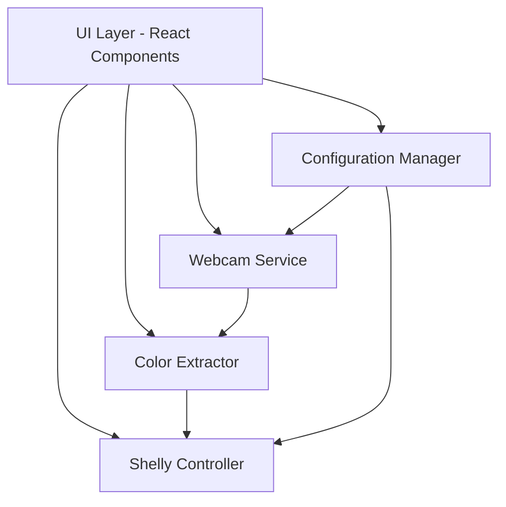
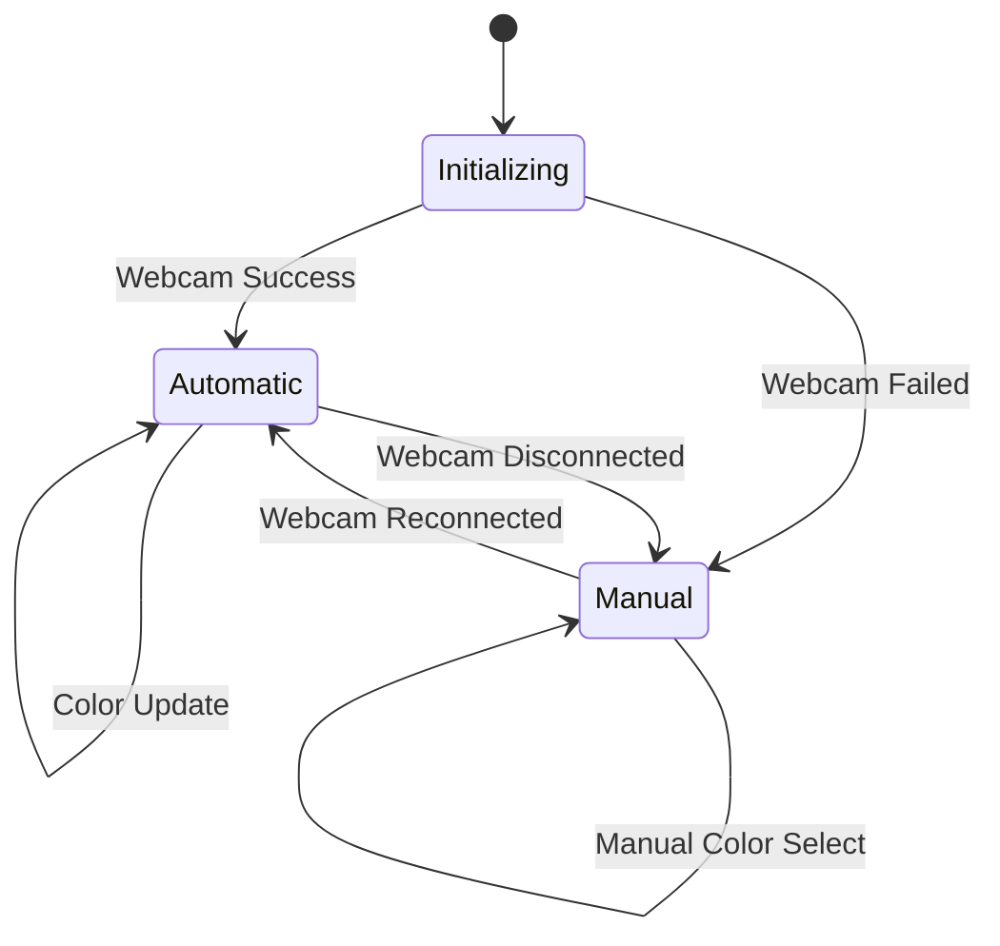
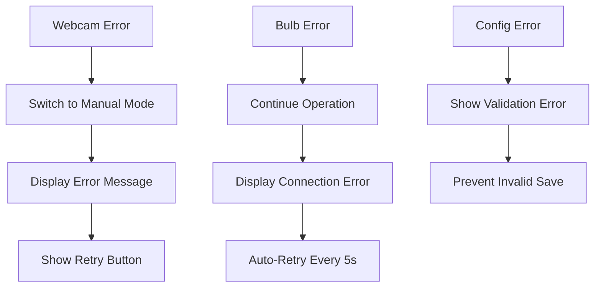

# Design Document: Shelly IoT Color Picker

## Overview

The Shelly IoT Color Picker is a browser-based web application built for live conference demonstration at JFokus 2026. The system captures video from a webcam, extracts the dominant color in real-time, and transmits it to a Shelly Gen1 IoT smart bulb via HTTP API. The architecture prioritizes reliability, visual feedback, and graceful degradation to ensure a successful live demo.

### Technology Stack

- **Frontend Framework**: React with TypeScript for type safety and component-based architecture
- **Build Tool**: Vite for fast development and optimized production builds
- **Webcam Access**: Browser MediaStream API (getUserMedia)
- **Color Extraction**: Canvas API with custom k-means clustering algorithm
- **HTTP Client**: Fetch API with timeout support
- **State Management**: React hooks (useState, useEffect, useReducer)
- **Styling**: CSS Modules for scoped, maintainable styles
- **Testing**: Vitest for unit tests, fast-check for property-based testing

### Design Principles

1. **Demo-First**: Every decision prioritizes reliability over features
2. **Test-Driven Development**: Tests written before implementation
3. **Visual Feedback**: Clear status indicators for audience visibility
4. **Graceful Degradation**: System continues operating when components fail
5. **Clean UI**: Modern, professional design without generic templates

## Architecture

The application follows a layered architecture with clear separation of concerns:



### Layer Responsibilities

**UI Layer**: Renders visual components, handles user interactions, displays status
**Service Layer**: Encapsulates business logic for webcam, color extraction, and IoT control
**Configuration Layer**: Manages persistent settings and validation

## Components and Interfaces

### 1. Webcam Service

Manages webcam access and frame capture using the MediaStream API.

```typescript
interface WebcamService {
  // Initialize webcam with specified device ID (null for default)
  initialize(deviceId: string | null): Promise<WebcamResult>
  
  // Get list of available video input devices
  getAvailableDevices(): Promise<MediaDeviceInfo[]>
  
  // Start capturing frames at specified FPS
  startCapture(fps: number, onFrame: (imageData: ImageData) => void): void
  
  // Stop capturing and release webcam
  stopCapture(): void
  
  // Get current video stream for display
  getVideoStream(): MediaStream | null
  
  // Check if webcam is currently active
  isActive(): boolean
}

type WebcamResult = 
  | { success: true; stream: MediaStream }
  | { success: false; error: WebcamError }

type WebcamError = 
  | 'permission-denied'
  | 'device-not-found'
  | 'device-in-use'
  | 'unknown-error'
```

**Implementation Details**:
- Uses `navigator.mediaDevices.getUserMedia()` for webcam access
- Captures frames by drawing video to an off-screen canvas
- Uses `requestAnimationFrame` with frame rate throttling
- Automatically releases resources on component unmount
- Handles permission errors with user-friendly messages

### 2. Color Extractor

Analyzes image data to determine the dominant color using k-means clustering.

```typescript
interface ColorExtractor {
  // Extract dominant color from image data
  extractDominantColor(imageData: ImageData, options: ExtractionOptions): RGB
  
  // Check if color has changed significantly
  hasSignificantChange(oldColor: RGB, newColor: RGB, threshold: number): boolean
}

interface ExtractionOptions {
  // Ignore pure black and white pixels
  ignoreExtremes: boolean
  
  // Number of clusters for k-means (default: 5)
  clusters: number
  
  // Sample every Nth pixel for performance (default: 4)
  sampleRate: number
}

interface RGB {
  red: number    // 0-255
  green: number  // 0-255
  blue: number   // 0-255
}
```

**Implementation Details**:
- Uses k-means clustering with k=5 to find dominant colors
- Samples every 4th pixel to reduce computation (configurable)
- Filters out pure black (0,0,0) and pure white (255,255,255) pixels
- Calculates Euclidean distance in RGB space for change detection
- Threshold of 10% (25.5 per channel) for significant changes
- Runs in <100ms for 640x480 frames

### 3. Shelly Controller

Communicates with Shelly Gen1 bulb via HTTP API.

```typescript
interface ShellyController {
  // Set bulb color with RGB values
  setColor(color: RGB): Promise<ShellyResult>
  
  // Test connection to bulb
  testConnection(): Promise<boolean>
  
  // Get current bulb status
  getStatus(): Promise<ShellyStatus | null>
  
  // Update bulb IP address
  updateBulbAddress(ipAddress: string): void
}

interface ShellyStatus {
  isOn: boolean
  brightness: number
  red: number
  green: number
  blue: number
  source: string
}

type ShellyResult =
  | { success: true; status: ShellyStatus }
  | { success: false; error: ShellyError }

type ShellyError =
  | 'network-error'
  | 'timeout'
  | 'invalid-response'
  | 'bulb-offline'
```

**Implementation Details**:
- Uses Fetch API with 2-second timeout via AbortController
- Endpoint format: `GET http://<ip>/color/0?turn=on&red=<r>&green=<g>&blue=<b>`
- Implements exponential backoff for reconnection (5s, 10s, 20s)
- Queues color updates to prevent request flooding
- Validates IP address format before requests
- Handles CORS issues with appropriate error messages

### 4. Configuration Manager

Manages persistent application settings.

```typescript
interface ConfigManager {
  // Get current configuration
  getConfig(): AppConfig
  
  // Update configuration
  updateConfig(config: Partial<AppConfig>): void
  
  // Validate IP address format
  validateIpAddress(ip: string): boolean
  
  // Reset to default configuration
  resetToDefaults(): void
}

interface AppConfig {
  shellyBulbIp: string
  selectedWebcamId: string | null
  captureFrameRate: number  // FPS
  colorChangeThreshold: number  // 0-255
  autoReconnect: boolean
}
```

**Implementation Details**:
- Uses localStorage for persistence
- Validates all settings before saving
- Provides sensible defaults (10 FPS, threshold 25.5)
- IP validation using regex pattern
- Emits events on configuration changes

### 5. UI Components

React components for visual interface.

```typescript
// Main application component
interface AppProps {}

// Live video feed display
interface VideoFeedProps {
  stream: MediaStream | null
  isActive: boolean
}

// Color swatch showing current dominant color
interface ColorSwatchProps {
  color: RGB
  label: string
}

// Connection status indicator
interface StatusIndicatorProps {
  type: 'webcam' | 'bulb'
  status: 'connected' | 'disconnected' | 'connecting'
}

// Manual color picker fallback
interface ManualColorPickerProps {
  onColorSelect: (color: RGB) => void
  currentColor: RGB
}

// Settings panel for configuration
interface SettingsPanelProps {
  config: AppConfig
  onConfigChange: (config: Partial<AppConfig>) => void
  onTestConnection: () => Promise<boolean>
}
```

**Component Hierarchy**:
```
App
├── Header (title, status indicators)
├── VideoFeed (webcam display)
├── ColorDisplay
│   ├── ColorSwatch (large color preview)
│   └── RGBValues (numeric display)
├── ManualColorPicker (fallback mode)
└── SettingsPanel (configuration)
```

## Data Models

### Application State

```typescript
interface AppState {
  // Webcam state
  webcam: {
    status: 'inactive' | 'initializing' | 'active' | 'error'
    error: WebcamError | null
    availableDevices: MediaDeviceInfo[]
    stream: MediaStream | null
  }
  
  // Color state
  color: {
    current: RGB
    previous: RGB
    lastUpdate: number  // timestamp
  }
  
  // Shelly bulb state
  bulb: {
    status: 'disconnected' | 'connecting' | 'connected' | 'error'
    error: ShellyError | null
    lastSuccessfulUpdate: number  // timestamp
    reconnectAttempts: number
  }
  
  // UI state
  ui: {
    mode: 'automatic' | 'manual'
    showSettings: boolean
    isInitializing: boolean
  }
  
  // Configuration
  config: AppConfig
}
```

### State Transitions




## Correctness Properties

A property is a characteristic or behavior that should hold true across all valid executions of a system—essentially, a formal statement about what the system should do. Properties serve as the bridge between human-readable specifications and machine-verifiable correctness guarantees.

### Property 1: RGB Output Range Invariant

*For any* image data input to the Color Extractor, the returned RGB values must be in the valid range [0, 255] inclusive for each channel.

**Validates: Requirements 2.2**

### Property 2: Color Change Detection Threshold

*For any* pair of RGB colors, the change detection algorithm must correctly identify whether the difference exceeds 10% (25.5 units) in any channel.

**Validates: Requirements 2.3**

### Property 3: Extreme Color Filtering

*For any* image data containing only pure black (0,0,0) and/or pure white (255,255,255) pixels, the Color Extractor must exclude these pixels from dominant color calculation.

**Validates: Requirements 2.4**

### Property 4: Shelly API URL Format

*For any* valid RGB color and IP address, the generated Shelly API URL must match the format `http://<ip>/color/0?turn=on&red=<r>&green=<g>&blue=<b>` with correct parameter encoding and 2-second timeout.

**Validates: Requirements 3.5, 3.6**

### Property 5: Webcam Error Handling

*For any* webcam error (permission denied, device not found, device in use), the system must switch to fallback mode without crashing and display a user-friendly error message.

**Validates: Requirements 1.3, 6.1**

### Property 6: Bulb Error Resilience

*For any* network error or timeout when communicating with the Shelly bulb, the system must continue operating (not crash), display connection error status, and not block UI or color extraction.

**Validates: Requirements 3.3, 6.2, 6.5**

### Property 7: Error Message Formatting

*For any* error that occurs in the system, the UI must display a non-technical, audience-friendly message while logging technical details to the console.

**Validates: Requirements 6.3, 6.4**

### Property 8: UI State Consistency

*For any* system state (webcam active/inactive, bulb connected/disconnected, automatic/manual mode), the UI must correctly display corresponding status indicators and available controls.

**Validates: Requirements 4.3, 5.1, 5.3**

### Property 9: Manual Color Picker Integration

*For any* color selected through the manual color picker, the system must send it to the Shelly bulb using the same controller method as automatic mode.

**Validates: Requirements 5.2**

### Property 10: IP Address Validation

*For any* string input as a Shelly bulb IP address, the system must validate it matches IPv4 format (xxx.xxx.xxx.xxx) before attempting connection.

**Validates: Requirements 8.2**

### Property 11: Configuration Persistence Round-Trip

*For any* valid configuration object, saving it to localStorage and then loading it back must produce an equivalent configuration object.

**Validates: Requirements 8.5**

### Property 12: Webcam Device Selection

*For any* list of available webcam devices with more than one device, the system must provide a UI control to select the desired device.

**Validates: Requirements 8.4**

### Property 13: Frame Rate Minimum

*For any* successful webcam session, the frame capture rate must meet or exceed 10 frames per second.

**Validates: Requirements 1.2**

### Property 14: Frame Processing Latency

*For any* captured frame, the time from capture to Color Extractor callback must not exceed 50 milliseconds.

**Validates: Requirements 1.5**

### Property 15: Color Extraction Performance

*For any* video frame (640x480 or larger), the Color Extractor must complete analysis and return a result within 100 milliseconds.

**Validates: Requirements 2.1**

### Property 16: Shelly Update Latency

*For any* new dominant color, the time from color determination to HTTP request sent must not exceed 200 milliseconds.

**Validates: Requirements 3.2**

### Property 17: Reconnection Timing

*For any* Shelly bulb connection failure, reconnection attempts must occur at 5-second intervals.

**Validates: Requirements 3.4**

### Property 18: UI Update Responsiveness

*For any* color change event, the UI must update the displayed color within 100 milliseconds.

**Validates: Requirements 4.5**

### Property 19: End-to-End Latency

*For any* color capture under normal conditions (webcam active, bulb connected), the total time from frame capture to bulb update must not exceed 500 milliseconds.

**Validates: Requirements 7.1**

### Property 20: Initialization Performance

*For any* application startup, the system must complete initialization and be ready for use within 5 seconds.

**Validates: Requirements 7.3**

### Property 21: Rapid Update Handling

*For any* sequence of more than 5 color changes per second, the system must process all changes without dropping frames or becoming unresponsive.

**Validates: Requirements 7.4**

### Property 22: Video Stream Display

*For any* active webcam state, the UI must render a video element with the MediaStream attached.

**Validates: Requirements 1.4**

## Error Handling

### Error Categories

**Webcam Errors**:
- Permission denied: User declined camera access
- Device not found: No camera available
- Device in use: Camera already in use by another application
- Unknown error: Unexpected MediaStream API failure

**Network Errors**:
- Timeout: Request exceeded 2-second limit
- Network error: No network connectivity or DNS failure
- Invalid response: Bulb returned unexpected data
- Bulb offline: Bulb not responding at configured IP

**Configuration Errors**:
- Invalid IP format: IP address doesn't match IPv4 pattern
- Invalid device ID: Webcam device ID not found

### Error Handling Strategy

1. **Non-Blocking**: All errors must be handled asynchronously without blocking the main thread
2. **User-Friendly Messages**: Display simple, non-technical messages in the UI
3. **Technical Logging**: Log full error details to console for debugging
4. **Graceful Degradation**: System continues operating in degraded mode
5. **Recovery Options**: Provide clear actions for users to recover (reconnect, retry, manual mode)

### Error Recovery Flows



## Testing Strategy

The application uses a dual testing approach combining unit tests and property-based tests for comprehensive coverage.

### Unit Testing

Unit tests focus on specific examples, edge cases, and integration points:

- **Component rendering**: Verify React components render correctly with various props
- **User interactions**: Test button clicks, form submissions, color picker interactions
- **Edge cases**: Empty device lists, null streams, boundary values
- **Error conditions**: Specific error scenarios and their handling
- **Integration points**: Component communication and state updates

**Framework**: Vitest with React Testing Library
**Coverage Target**: 80% line coverage for business logic

### Property-Based Testing

Property tests verify universal properties across randomized inputs:

- **Minimum 100 iterations per test** to ensure comprehensive input coverage
- Each test references its design document property number
- Tag format: `Feature: shelly-iot-color-picker, Property N: [property description]`

**Framework**: fast-check for TypeScript property-based testing

**Key Property Tests**:
- RGB range validation with random image data
- Color change detection with random color pairs
- URL formatting with random IPs and RGB values
- Error handling with various error types
- Configuration round-trip with random valid configs
- Timing properties with mocked timers and random delays

### Test Organization

```
src/
├── services/
│   ├── WebcamService.ts
│   ├── WebcamService.test.ts          # Unit tests
│   ├── WebcamService.properties.test.ts  # Property tests
│   ├── ColorExtractor.ts
│   ├── ColorExtractor.test.ts
│   ├── ColorExtractor.properties.test.ts
│   ├── ShellyController.ts
│   ├── ShellyController.test.ts
│   └── ShellyController.properties.test.ts
├── components/
│   ├── App.tsx
│   ├── App.test.tsx
│   ├── ColorSwatch.tsx
│   ├── ColorSwatch.test.tsx
│   └── ...
└── utils/
    ├── ConfigManager.ts
    ├── ConfigManager.test.ts
    └── ConfigManager.properties.test.ts
```

### Mocking Strategy

- **MediaStream API**: Mock `navigator.mediaDevices.getUserMedia()`
- **Fetch API**: Mock HTTP requests to Shelly bulb
- **localStorage**: Mock for configuration persistence tests
- **Timers**: Use fake timers for timing-related tests
- **Canvas API**: Mock for color extraction tests

### Testing Priorities

1. **Critical Path**: Webcam → Color Extraction → Shelly Update
2. **Error Handling**: All error scenarios must be tested
3. **Performance**: Timing properties validated with mocked timers
4. **UI State**: State transitions and visual feedback
5. **Configuration**: Validation and persistence

## Implementation Notes

### Performance Optimizations

1. **Frame Sampling**: Sample every 4th pixel in color extraction to reduce computation
2. **Debouncing**: Prevent excessive Shelly API calls with request queuing
3. **Web Workers**: Consider moving color extraction to worker thread if performance issues arise
4. **Canvas Reuse**: Reuse single canvas element for frame capture

### Browser Compatibility

- **Target**: Modern browsers with MediaStream API support (Chrome 53+, Firefox 36+, Safari 11+)
- **Required APIs**: getUserMedia, Canvas, Fetch, localStorage
- **Fallback**: Display browser compatibility message if APIs unavailable

### Security Considerations

1. **HTTPS Requirement**: Webcam access requires HTTPS (or localhost for development)
2. **CORS**: Shelly bulb must allow cross-origin requests (Gen1 devices typically do)
3. **Input Validation**: Validate all user inputs (IP addresses, color values)
4. **No Sensitive Data**: Application doesn't store or transmit sensitive information

### Development Workflow

1. **TDD Approach**: Write tests before implementation
2. **Component Isolation**: Develop and test each service independently
3. **Integration Testing**: Test component interactions after unit tests pass
4. **Visual Testing**: Manual testing of UI appearance and responsiveness
5. **Demo Rehearsal**: Full end-to-end testing with actual hardware before conference

### Deployment

- **Build**: Vite production build with minification
- **Hosting**: Static hosting (Netlify, Vercel, or GitHub Pages)
- **Configuration**: Environment variable for default Shelly IP (can be changed in UI)
- **Demo Setup**: Test connection to bulb before presentation, have backup manual mode ready

